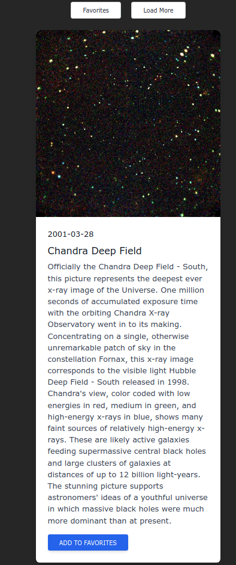

<div id="top"></div
<!-- PROJECT SHIELDS -->


<!-- PROJECT LOGO -->
<br />
<div align="center">

  <h2 align="center">Spacetagram</h3>

  <p align="center">
    A nasa space app that allows users to "like" card sections. Data is being pulled from NASA's Astronomy Picture of the Day API.
  </p>
</div>

## About The Project

<!-- USAGE EXAMPLES -->

## Usage



### Built with the following:

- [Tailwind](https://tailwindcss.com/docs/installation)
- [Animate CSS](https://animate.style/)
- [NASA APOD](https://api.nasa.gov/)
- [localStorage](https://developer.mozilla.org/en-US/docs/Web/API/Window/localStorage)
- [window](https://developer.mozilla.org/en-US/docs/Web/API/Window)
- [fetch](https://developer.mozilla.org/en-US/docs/Web/API/Fetch_API)

<!-- GETTING STARTED -->

## Getting Started

To get a local copy up and running follow these simple steps.

### Installation

1. Clone the repo
   ```sh
   git clone https://github.com/NatC02/spacetagram
   ```

## App structure

```
├── demo-image.jpg
├── favicon.jpg
├── index.html
├── README.md
├── scripts.js
└── styles.css
```

<!-- CONTRIBUTING -->

## Acknowledgments

Some of the resources I used or read while building this portfolio.

### Resources

- [Color Scheme](https://coolors.co/)
- [Github Pages](https://docs.github.com/en/pages/getting-started-with-github-pages/creating-a-github-pages-site)

<p align="right">(<a href="#top">back to top</a>)</p>